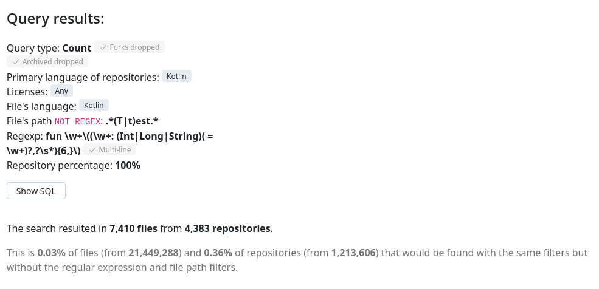
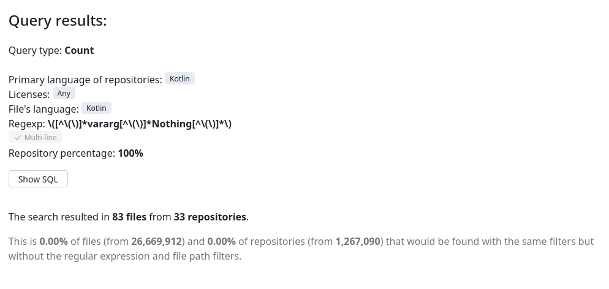

# Kotlin proposal: Enforced named form and argument labels

# Brief

On this page, two possible additions to the Kotlin programming language are described, with other ideas that can be implemented with them. The proposal, research on it, prototype and possible further implementation also serves as a bachelor's thesis for me, Mark Ipatov.

The additions are the following: the ability for the developer to mark some of their functions as requiring a **named form** of its **arguments** and the ability to use different names for inside and outside usage of argument names (by adding **argument labels**). 

These two ideas naturally come together, as they both are related to the introduction of new syntax to the function declaration, especially to its arguments and in my opinion, they can benefit from being implemented together. Now let us get to the specifics of each idea.

## Enforced named form (ENF)

Initially arose from issue [KT-14934](https://youtrack.jetbrains.com/issue/KT-14934/Enforce-parameter-usage-only-in-named-form), implementation of this idea will allow developers to restrict some of the parameters of their functions to accept only named form (i.e. `drawPoint(x = 5, y = 6)`). This could be useful to prevent passing values with the same type as argument, but with different meanings, especially when working with literals. The extreme case here is functions that accept multiple Boolean arguments.

## Argument labels (AL)

Firstly discussed in the same issue as the previous idea, this one has its own issue: [KT-34895](https://youtrack.jetbrains.com/issue/KT-34895/Internal-and-external-name-for-a-parameter-aka-Argument-Label). The idea is to allow developers to specify two names for an argument in their functions: external (argument label) and internal (parameter name). The external name acts as a use-site name, the one that is seen during the function call using the named form of arguments, and the internal acts as a parameter name, which is used in the body of a function. The main reason behind this is increased code readability and strive to make code more self-documenting.

One possible simple example of it (taken from the mentioned issues):

```kotlin
fun <E> List<E>.index([of] element: E): Int? {
    // Use the `element` variable to find its index in the list
}

someList.index(of = someElement) // Notice how this reads like a normal English phrase: index of someElement

fun distance([between] a: Int, [and] b: Int): Int {
    return abs(a - b)
}

val d = distance(between = 6, and = 9) // And again, the distance between 6 and 9, completely readable
```

It is worth noticing, that this feature is present in all languages that support ENF, and vice versa.

# Reasons and motivation

Now let us discuss possible reasons to implement these features, what can be allowed or implemented with the usage of them and whether they are useful.

Some of the arguments and examples were taken from YouTrack issues (links for issues mentioned are present), and some from different discussions on Swift and Kotlin forums. One such source is [this post on Kotlin forums](https://discuss.kotlinlang.org/t/kotlin-internal-and-external-parameter-name-propose/7906)

## Explicit indication of arguments meaning

If a function has many parameters of the same type, especially when this type is primitive, especially when the arguments are passed as constants or objects created at the place of calling, it becomes easy to mix up different parameters, ultimately resulting in hard-to-detect bugs. 

Easiest to imagine examples of this kind include functions with boolean flags to configure the function’s behavior.

**Enforcing named arguments form** solves this problem. The developer can mark the function or some of its arguments as requiring a named form and then everyone who will use it will specify the names of arguments, explicitly indicating the meaning of passed argument.

The problem is not a new thing, so there are already such solutions as boolean literal inspection (solution to [KTIJ-1634](https://youtrack.jetbrains.com/issue/KTIJ-1634/Add-inspection-for-boolean-literals-passed-without-using-named-parameters-feature)) as well as requests for more in-depth inspections ([KTIJ-18880](https://youtrack.jetbrains.com/issue/KTIJ-18880/Consider-more-sophisticated-inspection-for-same-looking-arguments-without-corresponding-parameter-names))

There is even a section in Coding Conventions about it: “Use the named argument syntax when a method takes multiple parameters of the same primitive type, or for parameters of `Boolean` type, unless the meaning of all parameters is clear from the context.” ([Named arguments](https://kotlinlang.org/docs/coding-conventions.html#named-arguments))

Talking about more specific examples, suppose we have the following function declaration:

```kotlin
fun reformat(
    str: String,
    normalizeCase: Boolean = true,
    upperCaseFirstLetter: Boolean = true,
    divideByCamelHumps: Boolean = false,
    wordSeparator: Char = ' ',
) { /*...*/ }
```

Compare two following ways to call it:

```kotlin
reformat("String!", false, false, true, '_')
// VS
reformat(
    "String!",
    normalizeCase = false,
    upperCaseFirstLetter = false,
    divideByCamelHumps = true,
    wordSeparator = '_'
)
```

Another couple of examples from real code from a Kotlin machine-learning library, https://github.com/Kotlin/kotlindl:

```kotlin
Conv2D(
        filters = 16,
        kernelSize = intArrayOf(5, 5),
        strides = intArrayOf(1, 1, 1, 1),
        activation = Activations.Tanh,
        kernelInitializer = GlorotNormal(SEED),
        biasInitializer = Zeros(),
        padding = ConvPadding.SAME
    )
```

```kotlin
model.use {
    it.compile(
        **optimizer = Adam(),
        loss = Losses.SOFT_MAX_CROSS_ENTROPY_WITH_LOGITS,
        metric = Metrics.ACCURACY**
    )

    it.printSummary()

    it.fit(
        **dataset = train,
        epochs = 10,
        batchSize = 100**
    )

    val accuracy = it.**evaluate(dataset = test, batchSize = 100)**.metrics[Metrics.ACCURACY]

    println("Accuracy: $accuracy")
    it.save(File("model/my_model"), writingMode = WritingMode.OVERRIDE)
}
```

It would be quite weird to use an unlabeled form in these examples.

## Self-documenting code

Understanding the code you read is crucial, and the faster and more accurate you can do it, the better the results will be. Therefore, it is useful to make source code more readable and understandable, and self-documenting code is one way to achieve it. 

For example, take an example of using Argument Labels from Swift. Suppose we have the following function:

```kotlin
func drawLine(start: CGPoint, end: CGPoint, width: CGfloat, colour: .UIColor) {
		line.moveTo(start)
		line.drawTo(end)
		line.setWidth(width)
		line.setColor(colour)
}
```

One of the simplest ways to call it is the following:

```swift
drawLine((100,50), (340,500), 5, red)
```

But it is quite hard to understand without seeing the declaration of the function before your eyes. But if the developer decides to enforce a named form of arguments, then the usage turns into:

```swift
drawLine(start=(100,50), end=(340,500), width=5, colour=red)
```

Which is way more readable. But still, you can add more readability by using argument labels

```swift
func drawLine(from start: CGPoint, to end: CGPoint, withThickness width: CGfloat, inColour colour: .UIColor) {
		line.moveTo(start)
		line.drawTo(end)
		line.setWidth(width)
		line.setColor(colour)
}

drawLine(from=(100,50), to=(340,500), withThickness=5, inColour=red)
```

All in all, both using the named form (and, therefore, enforcing it in some places) and using argument labels lead to improved code readability and reduced ambiguity, which results in a decreased amount of errors.

## Different meanings for arguments inside and outside

Sometimes the information that a developer needs to know about an argument differs from information that an end user needs to know. Not necessary that some information should be forgotten, but sometimes different sides need to have accents on different parts of the same arguments. Examples of this situation can be seen in the following examples, where it is quite difficult to come up with a meaningful name, that will have

```kotlin
// Suppose we have the following declaration using argument labels feature
fun <E> List<E>.max([by] comparator: Comparator<E>, [or] zero: E) {
	E result = zero
	for (item in this) {
		if (comparator.compare(result, item) > 0) {
			result = item
		}
	}
	return result
}

listOf(1, 2, 3, 4).max(by=naturalOrder, or=0) // pretty understandable
// VS
// Choose names `by` and `or` for function body
fun <E> List<E>.max(by: Comparator<E>, or: E) {
	E result = or // Ouch!
	for (item in this) {
		if (**by.compare**(result, item) > 0) { // Ouch!
			result = item
		}
	}
	return result
}
// or choose names `comparator` and `zero` for labels
listOf(1, 2, 3, 4).max(**comparator**=naturalOrder, **zero**=0) // meh...
```

Another, a little bit more complicated and closer to reality example:

```kotlin
// Suppose we have a public API for requests
// And we do not use the argument labels feature
interface Repo {
    fun startRequest(query: String,
                     successAction: () -> Unit,
                     failureAction: (Throwable) -> Unit,
                     **observeOn: Scheduler**) /* <-- Okay so far... */
}

// From user's side everything is okay:
val repo = Repo()
repo.startRequest(
        query = "Foo",
        successAction = { /* ... */ },
        failureAction = { throwable -> /* ... */ },
        **observeOn = Schedulers.computation()** /* <-- Very clear what this does */
)
// But from the developer side things will turn a little bit unobvious
internal class DefaultRepo : Repo {
    override fun startRequest(query: String,
                              successAction: () -> Unit,
                              failureAction: (Throwable) -> Unit,
                              observeOn: Scheduler) {

        val disposable = retrofitApi.fooRequest(query = query)
                **.observeOn(observeOn)** /* who is `observeOn`? (in this particular case we can say that from the type name, but this is not always the case) */
                .doOnSuccess(successAction)
                .doOnError(failureAction)
                .subscribe()
    }
}
// Inverse situation: choose `scheduler` as a name for the argument
val repo = Repo()
repo.startRequest(
        query = "Foo",
        successAction = { /* ... */ },
        failureAction = { throwable -> /* ... */ },
        **scheduler = Schedulers.computation()** /* what is this scheduler used for? */
)
```

## Support of developing API

Suppose the part of the project you are working on is still in development, so its API is still frequently changing. But there are already some uses of the function in the project, and, possibly, not by you, so frequent changes of API are not really favourable. The worst case is when the function you work on is in some part of a library, and the end users use your library and depend on it.

In this situation, different changes, related to the addition/rearranging of function arguments are likely to ruin compatibility, which will require updating every usage, or, if some arguments with the same type were swapped, can even lead to subtle bugs, that will be noticed only sometime after. And all it can happen even if there were not actually any meaningful changes to the parameters that were used.

But if the end user were **forced to use a named form**, such changes would less likely affect them. The parameters could be rearranged, or there could be new, probably optional parameters added, and the end user would not be disturbed without a reason.

If one is able external **argument labels**, then they can even change the internal parameter names ****as a part of the refactoring process, and the end user will not have to do anything after this kind of update.

Therefore, the implementation of enforcement of named form of arguments and argument labels can lead to a better experience during function evolution in public APIs.

Another description of a situation, taken directly from an issue discussion:

“Here is an additional use-case. When designing a DSL I might have a function with many params and I know that I will adding more params in the future. If people rely on parameter position, then me adding more parameters may break source compatibility. I was to preserve future source compatibility by forcing all my advanced params to be used in named form only.

The related story is for the last lambda parameters that can be used outside of parenthesis. I also want to avoid it being used positionally in such case. However, "forcing its usage in named form" shall still also allow its usage after the closing parenthesis. This way, if I have something like:

```kotlin
fun myBuilder(param1: T1, param2: T2, ..., paramN: TN, body: () -> Unit)
```

and only named usage if forced like this:

```kotlin
myBuilder(paramI = valI, ...) { ... }
```

I can safely add more named params before `body`, still being sure that old sources compile.”

## Multiple variadic arguments

In Kotlin, as in many older programming languages, there can be only one variadic argument in a function. But do we really need this limitation, or is it here present as a remnant of old times? There are languages, where one can use as many variadics as they want, including Swift and Scala, the latter being a JVM language.

Here is an example in Swift with the usage of two variadic parameters in one function. 

```swift
extension UIView {
  func addSubviews(_ views: UIView..., constraints: NSLayoutConstraint...) {
    views.forEach {
      addSubview($0)
      $0.translatesAutoresizingMaskIntoConstraints = false
    }
    constraints.forEach { $0.isActive = true }
  }
}

myView.addSubviews(v1, v2, constraints: v1.widthAnchor.constraint(equalTo: v2.widthAnchor),
                                        v1.heightAnchor.constraint(equalToConstant: 40),
                                        /* More Constraints... */)
```

Of course, one could replace some of the variadics with arrays, but replacing only one of them looks inconsistent, and replacing both results in additional visual overhead without particular reason.
Further discussions about lifting the limitation in Swift: [on forums](https://forums.swift.org/t/lifting-the-1-variadic-param-per-function-restriction/33787?u=owenv)

Another example from discussions and proposal [SE-0284](https://github.com/apple/swift-evolution/blob/main/proposals/0284-multiple-variadic-parameters.md):

```swift
func assertArgs(
      _ args: String...,
      parseTo driverKind: DriverKind,
      leaving remainingArgs: ArraySlice<String>,
      file: StaticString = #file, line: UInt = #line
    ) throws { /* Implementation Omitted */ }

try assertArgs("swift", "-foo", "-bar", parseTo: .interactive, leaving: ["-foo", "-bar"])
```

Looks pretty inconsistent with the first argument being passed as a variadic argument, and the second being passed as an `ArraySlice`.

All in all, it seems that it can be beneficial to lift the limitation. And, what is also important, it does not need any introduction of a new syntax: in Kotlin every argument after `vararg` already needs to be in named form, therefore it becomes pretty trivial to separate further variadic arguments from others.

## Parameter names of interface functions

There is a problem related to the implementation of generic interfaces for more specific cases: usually, it would be more meaningful to use different names, as can be seen in the following example from the related issue: [KT-59531](https://youtrack.jetbrains.com/issue/KT-59531/Add-a-way-to-make-parameter-names-of-interface-functions-non-stable)

```kotlin
interface Consumer<T> {
    fun consume(input: T)
}

class MessageConsumer : Consumer<Message> {
    override fun consume(message: Message) = …
}

fun send(message: Message) {
   val consumer: Consumer<Message> = …
   consumer.consume(message)
   consumer.consume(input = message)
   consumer.consume(message = message) // error, no overload with that parameter name / incorrect parameter name

   val messageConsumer: MessageConsumer = …
   messageConsumer.consume(message)
   messageConsumer.consume(message = message)
   messageConsumer.consume(input = message) // error, incorrect parameter name (but might as well be allowed)
}
```

Another example of this problem:

Suppose we have an interface:

```kotlin
@FunctionalInterface
interface Fn2<A, B, R> : BiFunction<A, B, R>, (A, B) -> R {
    @JvmDefault
    override operator fun invoke(p1: A, p2: B): R {
        ...
```

And then there is an implementation

```kotlin
object: Fn2<Int,Int,Int> {
    override fun invokeEx(accum: Int, i: Int): Int =
    accum + i
}
```

It is meaningless to use old names in a new context, so we introduced new ones and got a warning:  `Warning:(598, 76) Kotlin: The corresponding parameter in the supertype 'Fn2' is named 'a'. This may cause problems when calling this function with named arguments.`

Maybe there is some way to do something with it using argument labels? Special labels, or making it possible to change names of outer/inner labels during overwriting? Or maybe, as it was suggested in the related [stackoverflow question](https://stackoverflow.com/questions/50672203/kotlin-explicitly-unnamed-function-arguments), use an unnamed parameter in the interface definition? 

Another related example of it can be seen in the following issue: [KT-9872](https://youtrack.jetbrains.com/issue/KT-9872/Disallow-calling-a-method-with-named-argument) 

## Unused arguments

Highly related to the previous topic, [KT-8112](https://youtrack.jetbrains.com/issue/KT-8112/Provide-syntax-for-nameless-parameters), also known as nameless parameters. Can be implemented using empty labels/empty parameter names.

## Overload by parameters name

Some wish to have the ability to have different functions with the same name and signature, which differ only in the way the arguments are labelled. As mentioned in issue [KT-43016](https://youtrack.jetbrains.com/issue/KT-43016/Support-method-overloads-on-parameter-names-like-Swift), it states that there is already a way to do this, especially in Kotlin/Native, generating C interoperability stubs.

And it seems that there actually is something like that, at least [in Kotlin specification](https://kotlinlang.org/spec/overload-resolution.html#call-with-named-parameters)

Even `@Suppress("conflicting_overloads")` annotation is present.

# Current state

Here I will describe, whether and how these ideas are implemented in different languages, what is the widespread of the problems and how the solutions are currently tackled in Kotlin.

## Functions with multiple primitive arguments

According to BigCode platform, functions with multiple primitive arguments are widely present in the global codebase, including Android Development. Some examples may include functions which accept coordinates, functions to work with images etc. Those functions are the primal source of different errors and bugs related to mixing of arguments of some type and passing literals into functions, so **enforcing the named form** of arguments can be really helpful in these cases.

Some of the examples are part [of an Android application, responsible for working with a database](https://github.com/GrzegorzDawidek/AndroidZal/blob/e942947fdd01b3191f472cf378e46c6523a93721/app/src/main/java/com/example/sqllitetask/DatabaseHelper.kt), a [simple image utility](https://github.com/2T-T2/ImageUtil/blob/acc3eb444365caf89e014de9747831b0fec9cbe6/src/ImageUtil.kt) and a [small part of a shopping app](https://github.com/jiangyuanyuan/KotlinMall/blob/0e58f238614a4ba2644712ce4190290c9e19bed0/GoodsCenter/src/main/java/com/kotlin/goods/presenter/GoodsDetailPresenter.kt).

While those are definitely not examples of clean and good code, the fact is: that people do write like that, and they do use Kotlin, and, probably, some people even depend on their code. 

Moment for more general statistics using the BigCode platform:

Functions using **six** arguments of primitive types are present in 0.36% of files from active repositories:



Broadening the range of primitive types and lowering the number required to four results in a much bigger number: 4.26% of files in active repositories:


This seems like a significant part of the global codebase, in my opinion.

## Enforcing named form

This part is dedicated to depicting different currently existing ways to implement or work with enforcing the named form of function arguments, split into parts by ways and languages.

## Enforcing named form: Kotlin improvisation

There is a way in Kotlin to make some arguments of a function be always named, but it uses `vararg nothings: Nothig`, which is forbidden (there is a compilation error, which can be suppressed), and it looks weird and takes space for, in a fact, separator.

```kotlin
/* requires passing all arguments by name */
fun f0(vararg nothings: Nothing, arg0: Int, arg1: Int, arg2: Int) {}
f0(arg0 = 0, arg1 = 1, arg2 = 2)    // compiles with named arguments
//f0(0, 1, 2)                       // doesn't compile without each required named argument

/* requires passing some arguments by name */
fun f1(arg0: Int, vararg nothings: Nothing, arg1: Int, arg2: Int) {}
f1(arg0 = 0, arg1 = 1, arg2 = 2)    // compiles with named arguments
f1(0, arg1 = 1, arg2 = 2)           // compiles without optional named argument
//f1(0, 1, arg2 = 2)                // doesn't compile without each required named argument
```

The example is taken from [stackoverflow](https://stackoverflow.com/questions/37394266/how-can-i-force-calls-to-some-constructors-functions-to-use-named-arguments/37394267#37394267), where the question about the possibility of doing this was initially asked.

This method was discussed in issue [KT-12846](https://youtrack.jetbrains.com/issue/KT-27282/Allow-vararg-parameters-of-type-Nothing), and deemed strange and “looks really like a hack”. The issue was closed in favour of the main, [KT-14934](https://youtrack.jetbrains.com/issue/KT-14934/Enforce-parameter-usage-only-in-named-form).

And, as it can be seen from BigCode query, practically no one uses this approach, at least in the queried codebase:



## Enforcing named form: Kotlin annotation

At some point, the idea and need for it arose again, and it was proposed to imitate this behaviour using annotations, which [were requested](https://discuss.kotlinlang.org/t/add-annotation-or-other-mechanism-to-force-named-arguments-for-method/15636/2), and, sometime later, [implemented](https://github.com/chao2zhang/RequireNamedArgument).

```kotlin
@NamedArgsOnly
fun buildSomeInstance(param1: Boolean = true, param2: Boolean = false /* so on */)

// Ok
buildSomeInstance(param1=false, param2=true)

// Compilation error
buildSomeInstance(false, true)
```

The problem with this method is that it is an annotation, a mechanism that is (apparently) unreliable and heavily abused to modify the compiler’s behaviour. Moreover, this approach will not work for libraries that want to require consumers to specify the argument names (and want to provide overloads differing only in the names of the arguments; look to the *overload by argument name* section).

## Enforcing named form (and Argument label): Swift

In Swift both of the features are present and, more than that, named form and argument labels are the default, meaning that to pass an argument in the unnamed form you need to specify it in the function declaration. 

Example from [Swift documentation](https://docs.swift.org/swift-book/documentation/the-swift-programming-language/functions/):

```swift
func fun(argumentLabel parameterName: Type) {}

func greet(person: String, from hometown: String) -> String {
    return "Hello \(person)!  Glad you could visit from \(hometown)."
}
print(greet(person: "Bill", from: "Cupertino"))
// Prints "Hello Bill!  Glad you could visit from Cupertino."
```

There is a long discussion on how and when to use named form (outdated by 8 years, but still why not): [on swift forums](https://forums.swift.org/t/when-to-use-argument-labels-a-new-approach/1289)

### Remark on Swift function arguments

There is a way to pass an argument without specifying an argument label: give it an “empty” label (`func test(_ a: Int) {}`).

All arguments in Swift **still have fixed positions**, and you cannot change their order, despite them being uniquely named.

If you don’t explicitly specify the argument label, it will be implicitly equal to the parameter name.

### Objective-C

Being something of an ancestor for Swift, Objective-C also has such features.

## Multiple variadic arguments

While being only a part of the total list of ideas, this one is interesting for it being implemented with particular ease.

## Multiple variadic arguments in Swift

In Swift, one can actually use multiple variadic arguments in one function with ease. 

That was added in one of the proposals, but it was more of a restriction lifting than a new thing: the only change was to remove the limitation from the parser. Proposal link: [SE-0284](https://github.com/apple/swift-evolution/blob/main/proposals/0284-multiple-variadic-parameters.md)

As with all parameters after a variadic, all subsequent variadics must be labelled

There is a discussion about it: [on swift forum](https://forums.swift.org/t/lifting-the-1-variadic-param-per-function-restriction/33787?u=owenv)

## Multiple variadic arguments in Scala

What is interesting, is that Scala, a JVM-based language, also can have multiple variadic arguments, by usage of the currying syntax to separate different variadic arguments from each other.

Here is [the discussion on stackoverflow](https://stackoverflow.com/questions/30133367/scala-why-cant-a-method-have-multiple-vararg-arguments) about it.

And here is the part about currying (also known as multiple parameters list) in the official documentation: [multiple parameters lists](https://docs.scala-lang.org/tour/multiple-parameter-lists.html)

Simple example of it in use:

```scala
def varargUse(ints: Int*)(strings: String*) =
	ints.mkString(" ") + string.mkString(" ")

varargsUse(1, 2, 3)("a", "b")
// >> 1 2 3a b: java.lang.String
```

How does it work? Pretty simple: before compilation to JVM, two of the compilation parts are desugaring and uncurrying, during which such varargs are being turned into `scala/collection/immutable/Seq<Ljava/lang/Object>` and merged into a single parameters list.

This way, by the time of compilation into JVM Bytecode, there is no trace of variadics left in the source.

And, [judging by the Github search](https://github.com/search?q=language%3AScala++%2Fdef.*%5BA-Za-z%5D%2B%5C*.*%5BA-Za-z%5D%2B%5C*.*%3D%2F&type=code), some people do use multiple variadic arguments in their function.

## Variadic arguments in Kotlin and Java

In the process of compilation of both Kotlin and Java into bytecode, all variadic arguments are also desugared and therefore turned into arrays. The only difference here is that these languages use actual JVM arrays, and also mark the function with variadic argument with flag `ACC_VARARGS`. But, as it turns out, if you compile the same Kotlin code using an array and using variadics, the result will be the same to the point of initial source code lines difference and presence of the flag `ACC_VARARGS`. 

What is the particular use of this flag, apart from indicating the presence of a variadic argument *in the initial source code?* 

## Other remarks on function arguments in Kotlin

Named arguments do not have to be passed in specific orders. Named and unnamed arguments can be mixed, but only when the values of all other arguments *can be deduced* from the named ones. That is not always clear. There can be only one variadic argument in a function, but it can be placed at any point of the arguments list, although all arguments after it have to be in a named form. Except for the case, when the last argument is a (lambda) function, which does not have to be named if passed as a trailing lambda

# Things to consider

What possible areas and places could these ideas affect, and how should they be considered?

ENF is pretty solid when talking about the passing of literals, but what to do if someone passes a variable with a self-explanatory name?

Another counterpoint: IDEs (IntelliJ IDEA) already highlight argument’s names, so why would we need it?

- Not everyone has this IDE,  for example, when you are reviewing a pull request in GitHub. Or Android Studio.

It's worth providing 2 severity levels of message when such parameter is passed in positional form: warning or error. The use case is when you already have a function and you want to make one of its parameters named only. Instead of breaking user code with an error, a warning and a quick fix would gently encourage migrating to that style of argument passing.

There are related issues for position-based destructing for data classes. “If the way to enforce parameter usage in named form is implemented, then it would be logical to extend it all the way to the data-class restructuring. That is, if constructor parameters' usage is somehow enforced to be in named form, then positional restructuring for those parameters shall be disabled, too.”

Things to consider regarding the interaction with [KT-14934](https://youtrack.jetbrains.com/issue/KT-14934/Enforce-parameter-usage-only-in-named-form) and [KT-9872](https://youtrack.jetbrains.com/issue/KT-9872/Disallow-calling-a-method-with-named-argument):

- how to specify that a parameter doesn't have an external name and cannot be provided in a named form (Swift: `func foo(_ parameterName)`)
- how to specify that a parameter does have a different external name, but doesn't have to be provided in a named form only
- how to require a parameter to be provided in a named form only without duplicating its external name
- how to make a parameter unnamed internally ([KT-8112](https://youtrack.jetbrains.com/issue/KT-8112/Provide-syntax-for-nameless-parameters)) without spelling its external name if it can be inferred from e.g. a supertype method.

One may say that argument labels can be easily replaced by Kotlin rich type system (and using type aliases)

Counter: I don’t think that it is very useful to create a type for every place where you are going to use a primitive, especially when there are no other logic or limitations on the type. Also, this approach will not work when both parameters are already of some non-primitive type with some logic. Further thoughts: [reply on forum](https://discuss.kotlinlang.org/t/kotlin-internal-and-external-parameter-name-propose/7906/12)

## Reserved syntax

Parameter modifiers are already in the same place where Swift has argument labels.

```kotlin
send(vararg message: String)
send(noinline message: () -> String)
send(crossinline message: () -> String)
```

# Ways to implement

Different ideas on where and how these ideas can be implemented, concerning the Kotlin compiler. 

## Argument labels: where and how

Probably not the same way as Swift does, because it will end up colliding with parameter modifiers. One proposed idea is to use `as` as a keyword for it:

```kotlin
fun send(message: String,
                 port: ValidPort,
                 securityType: SecurityType,
                 withDelayBeforeSending: Delay = Delay.DEFAULT_DELAY as delay) { //...
```

Another way is to use brackets:

```kotlin
fun send(message: String,
                 port: ValidPort,
                 securityType: SecurityType,
                 [withDelayBeforeSending] delay: Delay = Delay.DEFAULT_DELAY) { //...
```
